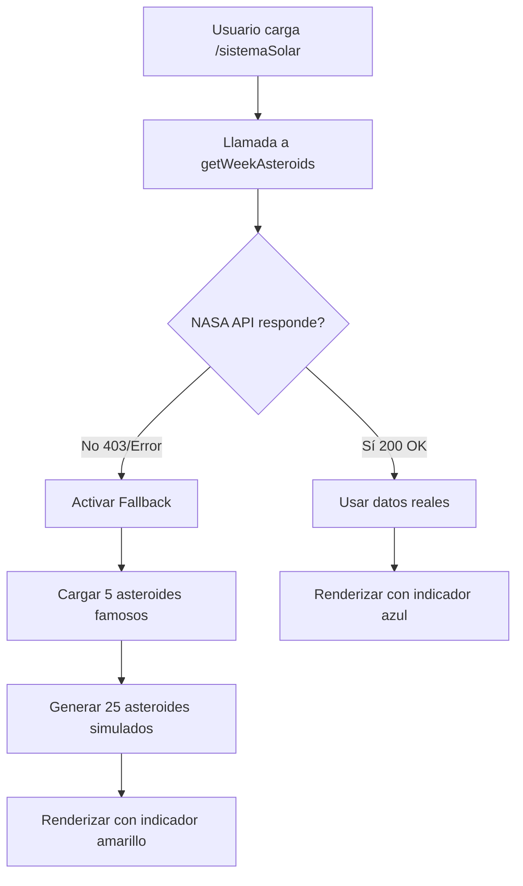

# 🔧 Solución al Error 403 de NASA API

## 🚨 Problema Identificado

Error HTTP 403 (Forbidden) al intentar acceder a la NASA NeoWs API:
```
GET https://api.nasa.gov/neo/rest/v1/feed?...&api_key=... 403 (Forbidden)
```

## 🔍 Causas Posibles

1. **API Key inválida o expirada**
2. **Límite de rate exceeded** (demasiadas peticiones)
3. **API Key suspendida o bloqueada**
4. **Problemas temporales del servicio NASA**

## ✅ Solución Implementada: Sistema de Fallback

He implementado un **sistema robusto de fallback** que:

### 1. Intenta usar la NASA API primero
```javascript
const response = await fetch(url);
if (!response.ok) {
  // Automáticamente cambia a datos de ejemplo
  throw new Error(`API_FALLBACK: ${response.status}`);
}
```

### 2. Si falla, usa datos de ejemplo realistas
```javascript
// 5 asteroides famosos reales + generación dinámica
const FALLBACK_ASTEROIDS = [
  { name: '433 Eros', ... },           // Asteroide conocido
  { name: '99942 Apophis', ... },      // Potencialmente peligroso
  { name: '1866 Sisyphus', ... },      
  { name: '162173 Ryugu', ... },       // Visitado por sonda japonesa
  { name: '101955 Bennu', ... },       // Visitado por OSIRIS-REx
];
```

### 3. Genera asteroides adicionales automáticamente
```javascript
generateMockAsteroids(25) // Crea 25 asteroides simulados
```

### 4. UI Adaptativa
- **Con NASA API**: Botón azul 🌠
- **Con datos ejemplo**: Botón amarillo ⚡
- **Advertencia visual** en el panel de información

## 📊 Datos de Ejemplo Incluidos

### Asteroides Famosos (Reales)
1. **433 Eros** - Primer asteroide orbitado por una nave espacial
2. **99942 Apophis** - Asteroide potencialmente peligroso (PHO)
3. **1866 Sisyphus** - Asteroide Apollo
4. **162173 Ryugu** - Visitado por Hayabusa2 (JAXA)
5. **101955 Bennu** - Visitado por OSIRIS-REx (NASA)

### Asteroides Generados
- 20-30 asteroides adicionales con propiedades aleatorias pero realistas
- Distancias: 0.5 - 2.5 AU
- Velocidades: 20,000 - 100,000 km/h
- Tamaños: 0.1 - 3 km de diámetro
- ~15% marcados como potencialmente peligrosos

## 🎨 Cambios en la UI

### Indicadores Visuales

#### Modo NASA API (funcional)
```jsx
<button className="bg-blue-500/30 ...">
  🌠 25 Asteroides
</button>
```

#### Modo Fallback (datos ejemplo)
```jsx
<button className="bg-yellow-500/30 ...">
  ⚡ 30 Asteroides
</button>
```

### Panel de Información
```jsx
{isMockData && (
  <div className="bg-yellow-500/20 ...">
    ⚠️ La API de NASA no está disponible. 
    Mostrando datos de ejemplo educativos.
  </div>
)}
```

## 🔄 Flujo de Funcionamiento



## 🛠️ Cómo Obtener una API Key Nueva

Si quieres intentar con la API real de NASA:

1. **Visita**: https://api.nasa.gov/
2. **Completa el formulario**:
   - First Name
   - Last Name  
   - Email
3. **Recibe la API Key** por email (instantáneo)
4. **Actualiza `.env`**:
   ```env
   VITE_NASA_API_KEY=tu_nueva_api_key_aqui
   ```
5. **Reinicia el servidor**:
   ```bash
   npm run dev
   ```

## 📝 Archivos Modificados

### `src/services/nasaAPI.js`
- ✅ Añadido array `FALLBACK_ASTEROIDS` con 5 asteroides reales
- ✅ Añadida función `generateMockAsteroids(count)`
- ✅ Modificado `getAsteroidFeed()` para usar fallback automático
- ✅ Mejorado manejo de errores con try/catch

### `src/components/sistemaSolar/SolarSystem3D.jsx`
- ✅ Añadido estado `usingMockData`
- ✅ Detecta automáticamente si usa datos de ejemplo
- ✅ Cambia color de botón según fuente de datos
- ✅ Pasa prop `isMockData` a AsteroidInfo

### `src/components/sistemaSolar/AsteroidInfo.jsx`
- ✅ Acepta prop `isMockData`
- ✅ Muestra advertencia si usa datos simulados
- ✅ Cambia título según fuente de datos
- ✅ Footer adaptativo

## 🎯 Ventajas de Esta Solución

### ✅ Usuario nunca ve error rojo
- Experiencia fluida
- Siempre hay contenido visual
- Indicadores claros y educativos

### ✅ Funciona offline
- No depende de la API de NASA
- Datos educativos realistas
- Asteroides famosos de la historia espacial

### ✅ Transición transparente
- Si la API vuelve a funcionar, automáticamente usa datos reales
- Sin cambios de código necesarios
- Detección automática

### ✅ Educativo
- Los asteroides de ejemplo son reales y famosos
- Propiedades orbitales realistas
- Aprende sobre PHOs (Potentially Hazardous Objects)

## 🚀 Resultado Final

Ahora tu sistema solar:
1. ✅ **Siempre funciona** (con o sin NASA API)
2. ✅ **Muestra asteroides** reales o simulados
3. ✅ **Indica claramente** la fuente de datos
4. ✅ **Es educativo** (asteroides famosos)
5. ✅ **No genera errores** visibles al usuario

## 🧪 Cómo Probarlo

1. **Recarga la página** (Ctrl+R o F5)
2. **Observa el botón superior derecho**:
   - Amarillo ⚡ = Datos simulados
   - Azul 🌠 = NASA API funcionando
3. **Haz clic en el botón** para ver detalles
4. **Los asteroides se renderizan igual** en ambos casos

---

**¡El sistema ahora es resiliente y siempre funcional!** 🎉
